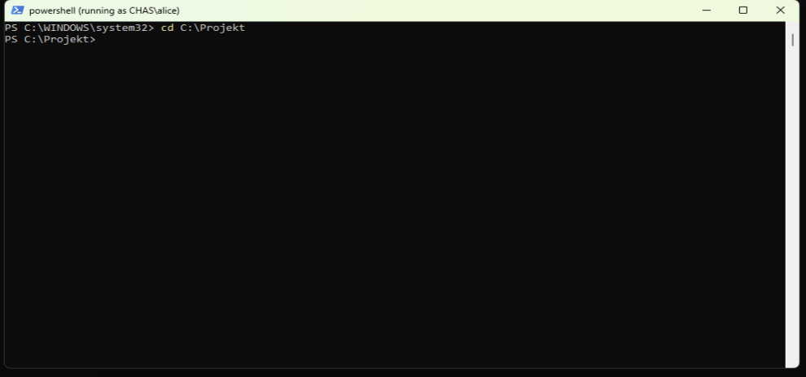
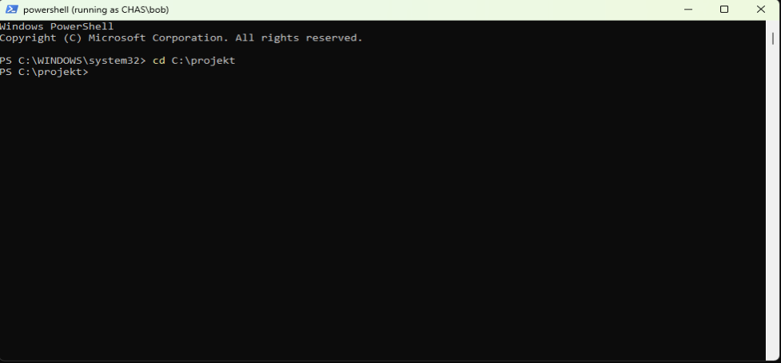

# Instruktioner & Bedömningsunderlag: Individuell Fördjupning
# 1. Introduktion

> [!IMPORTANT]
> **Kurs**: Introduktion till yrkesrollen och grunderna i IT-infrastruktur (MYH 2025/4008)
> 
> **Examinationsform**: Individuell teknisk fördjupningsuppgift (Summativ examination)
> 
> **Koppling till VG-krav i kursplanen**: Kursmål 2, 3 och 8

> [!TIP]
> **Student**: Joakim Tran
> 
> **Beskrivning**: _"Uppgiften bygger vidare på den praktiska labbmiljön samt teorin om nätverk, operativsystem och säkerhet. Den studerande ska självständigt analysera, konfigurerar 
> och dokumentera en avancerad labbsituation samt resonera kring underliggande mekanismer."_

# 2. Moment A: Avancerad Nätverksanalys & Trafikflöden (Mål 3)

**Beskrivning**: Mitt mål är att rita upp och förklara ett datapakets resa hela vägen från min dator i labbet ut på internet. Jag går igenom hur domännamnet först översätts via DNS, 
hur trafiken slussas ut genom det lokala nätet och gatewayen, samt vad som faktiskt sker i TCP/IP-modellens olika lager när MAC-adresser byts ut och IP- samt portadresser styr paketet till rätt destination.

## Nätverkets resa

Vi kan börja med att välja en adress eller domän. Varför inte den klassiska google.com (8.8.8.8)? Men först! Ska vi gå genom OSI | /TCP/IP? Vad är skillnanden mellan OSI och TCP/IP?
Det korta och snabba svaret är att TCP/IP "använder" 5 lager/skikt medans OSI "använder" 7 lager/skikt. Se bilden nedan för förtydligande. I detta fallet så räcker det gott och väl med TCP/IP


### TCP/IP

| Skikt (TCP/IP) | Data / Protokoll | Vad händer lokalt | Vad händer i routern/gatewayen (NAT)? |
| :--- | :--- | :--- | :--- |
| **Applikation (L7/L5)** | HTTP / TLS / DNS | Här skapas lasten eller förfrågan till google.com | Hittills opåverkad om den är krypterad, om inte så skickas det i öppen/klartext HTTP protokoll. Detta är farligt då allt är synligt och kan modifieras eller bli spårad |
| **Transport (L4)** | TCP / UDP | Här kan det sättas **Source Port** (t.ex.`50000` port range då det finns många fler att slumpmässa fram) och **Destination Port** som 99,9% är `443` för HTTPS, `53` för DNS (Vi pratar inte om dem andra just så som `80`för HTTP eller `853`för TLS just nu. Lite överkurs för denna presentationen). | **Port Address Translation (PAT):** Routern kanske behöver mappa om Source porten för att matcha vad NAT vill ha. Så att dem inte går till portar som är stängda eller helt enkelt underlätta kommunikationen mellan klienter och webbsida. |
| **Nätverk (L3)** | IP | Vi sätter t.ex. **Source IP** `192.168.1.50` och **Dest IP** (8.8.8.8) google.com. | **Source NAT eller bara NAT:** Här händer magin! Här tolkas och dirigeras nätverket till sina rätta platser. I detta fallet så vill `192.168.1.50` komma åt google.com (8.8.8.8) och routern gör sin magi och sen slussar den ut förfrågan till från routern, eller ja, från klientens perspektiv Gateway och nu måste förfrågan passera ut till den publika IP. Vi kan även snabbt ta upp TTL (Time to live). Alltså hur länge ett last/paket/förfrågan får "leva" på varje hopp fram till google.com. Annars så kan man råka ut att det åker runt i cirklar! Du trodde heller väl inte att det var en rakt sträcka till google.com!? |
| **Länk / Datalänk (L2)** | Ethernet | **Source MAC** (klientens nätverkskort) och **Destination MAC** (Default Gateways MAC-adress). | Ah! Dem fysiska länkarna och adresserna! Dem måste ju hitta varandra fysiskt också. MAC-adresser är som namnet på enheterna.**OBS!** Numera så kan man slumpmässa fram MAC-adresser för säkerhetens skull innan den skickas ut från publika IP eller att varje hopp/NAT men vi håller oss till privat nätverk så länge. Här tas reda på vilka och vad för enheter som pratas. I detta fallet är det ju klientens nätverkskort som säger till att jag har denna MAC-adress så du vet det! Gateway/routern säger "OKEJ! Då vet jag! Jag har denna MAC-adressen så du vet de med!" Coolt säger båda och nu är vi ihopkopplade via Ethernet och kan prata med varandra!


# 3. Moment B: Jämförande OS- och Behörighetsanalys (Mål 2)

## Linux/POSIX
Filen eller filerna tilldelas användaren _alice_ som personlig ägare och hennes primära grupp g_ledare som ägargrupp. I traditionell POSIX sker inget automatiskt arv av rättigheter från mapp och undermappar vid filskapande; filens modbitar avgörs istället av användarens umask(t.ex. 777). För att gruppen g_personal (Bob) ska få skrivåtkomst till Alice nyskapade fil krävs en Default ACL (setfacl -d), som tvingar filsystemet att automatiskt applicera accessreglerna för båda grupperna på varje nytt objekt under katalogen.
## Windows (NTFS/ACL)
Alice blir registrerad som filens ägare eftersom det var hon som skapade den, men i Windows spelar ägaren ingen roll för vem som får komma åt den.
Windows sköter arv helt automatiskt. Eftersom mappen Gemensamt var inställd på att skicka vidare sina rättigheter till nya filer p.g.a. OI (Object Inherited = Filens arv) och CI (Container Inherited= Mappens arv), får den nya filen direkt samma regler: g_personal får läsa och ändra (Modify). Det syns i behörighetslistan som ett litet (I) för Inherited (ärvt). Bob kan därför öppna och redigera filen direkt, utan att någon behöver göra något manuellt.


# 4. Moment C: Spårbarhet & Överlämningsdokumentation (Mål 8)

Vi kan köra skript eller klara kommandon!

## Linux/Ubuntu
Vi kan göra det via en shell/bash-skript. T.ex. `setup.sh`

```
# 1. Skapa grupper
sudo groupadd g_ledare
sudo groupadd g_personal

# 2. Skapa användare med hemkatalog och primär grupp
sudo useradd -m -s /bin/bash -g g_ledare alice
sudo useradd -m -s /bin/bash -g g_personal bob

# Sätt lösenord
echo "alice:Labb123!" | sudo chpasswd
echo "bob:Labb123!" | sudo chpasswd

# 3. Skapa kataloger
sudo mkdir -p /Projekt/Gemensamt
sudo mkdir -p /Projekt/Ledning
sudo chmod 755 /Projekt

# 4. Sätt behörigheter på Ledning (bara ledningen kommer åt)
sudo chown root:g_ledare /Projekt/Ledning
sudo chmod 770 /Projekt/Ledning

# 5. Sätt behörigheter på Gemensamt med POSIX ACL
sudo chown root:root /Projekt/Gemensamt
sudo chmod 770 /Projekt/Gemensamt
# Rättigheter på mappen nu:
sudo setfacl -m g:g_ledare:rwx,g:g_personal:rwx /Projekt/Gemensamt
# Arv för nya filer (-d):
sudo setfacl -d -m g:g_ledare:rwx,g:g_personal:rwx /Projekt/Gemensamt
```

## Windows
Okej, här får man köra powershell med administratörprivilgie och kolla vilket språk. <ins>***"admin"***</ins> är på för språk! Men annars kan vi typ göra en `setup.ps1`
```
# 1. Skapa lokala grupper
New-LocalGroup -Name "g_ledare"
New-LocalGroup -Name "g_personal"

# 2. Skapa användare och lägg till i grupper
$Password = ConvertTo-SecureString "Labb123!" -AsPlainText -Force
New-LocalUser -Name "alice" -Password $Password
New-LocalUser -Name "bob" -Password $Password

Add-LocalGroupMember -Group "g_ledare" -Member "alice"
Add-LocalGroupMember -Group "g_personal" -Member "bob"

# 3. Skapa katalogerna
New-Item -Path "C:\Projekt\Gemensamt" -ItemType Directory -Force
New-Item -Path "C:\Projekt\Ledning" -ItemType Directory -Force

# 4. Bryt arvet på Projekt-mappen och ta bort Users
icacls "C:\Projekt" /inheritance:r /grant:r "Administratörer:(OI)(CI)F" "SYSTEM:(OI)(CI)F"

# 5. Sätt behörigheter och arv på undermapparna
icacls "C:\Projekt\Gemensamt" /grant "g_ledare:(OI)(CI)M" "g_personal:(OI)(CI)M"
icacls "C:\Projekt\Ledning" /grant "g_ledare:(OI)(CI)M"
```

## Specifikation Moment B

> [!NOTE]
> ### Uppgiftsspecifikation: Moment B
> 
> #### 1. Företagsscenario & Konto-uppsättning
> Skapa följande kontostruktur i både Linux och Windows:
> * **Grupper:**
>   * `g_ledare` (För chefer/ledare)
>   * `g_personal` (För övrig personal)
> * **Användare:**
>   * `alice` (Medlem i `g_ledare`)
>   * `bob` (Medlem i `g_personal`)
> 
> #### 2. Mappstruktur & Kravmatris
> Skapa en huvudmapp som heter `Projekt` med två undermappar:
> 1. `Projekt/Gemensamt`
> 2. `Projekt/Ledning`
> 
> Sätt följande behörigheter på mapparna:
> 
> | Mapp | Grupp: `g_personal` (Bob) | Grupp: `g_ledare` (Alice) | Specialkrav / Testfall |
> | :--- | :--- | :--- | :--- |
> | **`Projekt/Gemensamt`** | Läsa & Skriva | Läsa & Skriva | Skapa en testfil här som båda ska kunna redigera. |
> | **`Projekt/Ledning`** | Ingen åtkomst | Läsa & Skriva | `g_personal` ska nekas tillträde helt. |
>
## System- och nätverksöversikt

* Virtualisering: VMware Workstation Pro
* Nätverkstyp: Isolated Network (VMnet2)
* Nätverkskonfiguration:
  * Windows 11 (`Chas`), IPv4 `192.168.136.128/24`, Gateway `192.168.136.1`
  * Ubuntu (`chas@chas-VMware-Virtual-Platform`), IPv4 `192.168.136.129`. Gateway `192.168.136.1`

### Råa kommandon

Okej! Håll i hatten nu! Nu kommer det mycket kommandon och text! **Håller du i hatten!?**

#### Ubuntu/Linux

```
# 1. Skapa konton och grupper. Först grupp och sedan användare med mappar och shell /bin/bash. Annars blir det DASH som är elementär terminal. glömde inte gruppen och sedan användare! Varför inte göra tillfälliga lösenord medans vi är här!
sudo groupadd g_ledare
sudo groupadd g_personal
sudo useradd -m -s /bin/bash -g g_ledare alice
sudo useradd -m -s /bin/bash -g g_personal bob
echo "alice:LabbLosen123!" | sudo chpasswd
echo "bob:LabbLosen123!" | sudo chpasswd

# 2. Skapa katalogstrukturen. chmod 755 på /projekt och dess underkataloger. Owner, group, others. Alltså Owner har alla rättigheter, group har rx (läsa och köra), others är detsamma som "group". 
sudo mkdir -p /Projekt/Gemensamt /Projekt/Ledning
sudo chmod 755 /Projekt

# 3. Mappen Ledning. Ägaren/användare root och därmed gruppen g_ledare ska ha rättigheter eller i direkt-översättning, ägarskapet. chmod 770, owner är rwx och detsamma med gruppen g_ledare, andra får inte vara med på mappen "Ledning"!
sudo chown root:g_ledare /Projekt/Ledning
sudo chmod 770 /Projekt/Ledning

# 4. Mappen Gemensamt (POSIX + ACL). Vi kan göra ägaren till root genom posix och göra via ACL också. I fall att Windows miljön inte kan läsa av POSIX. Helt enkelt, det är bra att göra både och! Glöm inte -m (modify) och -d (default(behaviour)). -d är alltså framtida filer och mappar har ärvda rättigheter som standard/default
sudo chown root:root /Projekt/Gemensamt
sudo chmod 770 /Projekt/Gemensamt
sudo setfacl -m g:g_ledare:rwx,g:g_personal:rwx /Projekt/Gemensamt
sudo setfacl -d -m g:g_ledare:rwx,g:g_personal:rwx /Projekt/Gemensamt
```

#### Windows

```
#Windows använder ACL eller DACL för filer och SACl för att kolla loggar. Men kan kalla det för ACl för enkelhetens skull.

Okej, håll i hatten hårdare!

#Här har vi Powershell! Förutom att det är svårt att komma ihåg så är det lättare att förstå kommadon.
New-LocalGroup -Name "g_ledare"; New-LocalGroup -Name "g_personal"
$Pass = ConvertTo-SecureString "DriftStandard2026!" -AsPlainText -Force
New-LocalUser -Name "alice" -Password $Pass; New-LocalUser -Name "bob" -Password $Pass
Add-LocalGroupMember -Group "g_ledare" -Member "alice"
Add-LocalGroupMember -Group "g_personal" -Member "bob"

New-Item -Path "C:\Projekt\Gemensamt" -ItemType Directory -Force
New-Item -Path "C:\Projekt\Ledning" -ItemType Directory -Force

# Här kanske vi kan börja att förklara. icacls (Integrity Control Access Control List) är kommandot för att hantera och visa rättigheter. Nu kan det bli lite rörigt. "inheritance" med -r tar bort alla ärvda behörigheter. grant:r är att bevilja och ersätt rättigheter med Adminstrators och OI är alla filer inuti mappen och CI är undermappar och F är Full behörighet eller på linux/POSIX; rwx. Glöm inte att SYSTEM behöver de också så att t.ex. antivirus och andra systemtjänster kan komma åt filerna och mapparna.
icacls "C:\Projekt" /inheritance:r /grant:r "Administrators:(OI)(CI)F" "SYSTEM:(OI)(CI)F"
# Kom ihåg att användare eller grupper kan ärva behörigheter eller ja, i folkmun, det du skapar ska du ha tillgång till och eventuellt andra behörigheter så som att adminstratörer ska tillgång till allt. M är för modify. Lite som "RWX" lite/slim. Dem kan ändra, läsa och köra men inte ändra behörigheter eller andra "admin" ändringar.
icacls "C:\Projekt\Gemensamt" /grant "g_ledare:(OI)(CI)M" "g_personal:(OI)(CI)M"
# Här tillåts endast g_ledare!
icacls "C:\Projekt\Ledning" /grant "g_ledare:(OI)(CI)M"
```

#### Testkörning

**Linux/Ubuntu**

```
chas@chas-VMware-Virtual-Platform:~$ sudo groupadd g_ledare
[sudo: authenticate] Password:     
chas@chas-VMware-Virtual-Platform:~$ sudo groupadd g_personal
chas@chas-VMware-Virtual-Platform:~$ sudo useradd -m -s /bin/bash -g g_ledare alice
chas@chas-VMware-Virtual-Platform:~$ sudo useradd -m -s /bin/bash -g g_personal bob
chas@chas-VMware-Virtual-Platform:~$ echo "alice:Labb123!" | sudo chpasswd
chas@chas-VMware-Virtual-Platform:~$ echo "bob:Labb123!" | sudo chpasswd
chas@chas-VMware-Virtual-Platform:~$ id alice
uid=1001(alice) gid=1001(g_ledare) groups=1001(g_ledare)
chas@chas-VMware-Virtual-Platform:~$ id bob
uid=1002(bob) gid=1002(g_personal) groups=1002(g_personal)
#Så här långt så funkar allt som det ska!

#nu till dett jobbiga!
chas@chas-VMware-Virtual-Platform:~$ sudo mkdir -p /Projekt/Gemensamt
chas@chas-VMware-Virtual-Platform:~$ sudo mkdir -p /Projekt/Ledning
chas@chas-VMware-Virtual-Platform:~$ sudo chown root:root /Projekt
chas@chas-VMware-Virtual-Platform:~$ sudo chmod 755 /Projekt
chas@chas-VMware-Virtual-Platform:~$ sudo chown root:g_ledare /Projekt/Ledning
chas@chas-VMware-Virtual-Platform:~$ sudo chmod 770 /Projekt/Ledning
chas@chas-VMware-Virtual-Platform:~$ sudo chown root:root /Projekt/Gemensamt
sudo chmod 770 /Projekt/Gemensamt
sudo setfacl -m g:g_ledare:rwx,g:g_personal:rwx /Projekt/Gemensamt
sudo setfacl -d -m g:g_ledare:rwx,g:g_personal:rwx /Projekt/Gemensamt
chas@chas-VMware-Virtual-Platform:~$ getfacl /Projekt/Gemensamt
getfacl: Removing leading '/' from absolute path names
# file: Projekt/Gemensamt
# owner: root
# group: root
user::rwx
group::rwx
group:g_ledare:rwx
group:g_personal:rwx
mask::rwx
other::---
default:user::rwx
default:group::rwx
default:group:g_ledare:rwx
default:group:g_personal:rwx
default:mask::rwx
default:other::---
#Ser bra ut! Other får ej vara med!

#Vi testar rättigheter och behörigheter!
chas@chas-VMware-Virtual-Platform:~$ sudo su - alice
alice@chas-VMware-Virtual-Platform:~$ cd /Projekt/Gemensamt
alice@chas-VMware-Virtual-Platform:/Projekt/Gemensamt$ echo "Skapat av Alice i Underlandet" > gemensam_fil.txt
alice@chas-VMware-Virtual-Platform:/Projekt/Gemensamt$ ls -la gemensam_fil.txt
-rw-rw----+ 1 alice g_ledare 30 Sep 30 20:35 gemensam_fil.txt
alice@chas-VMware-Virtual-Platform:/Projekt/Gemensamt$ exit
logout
#+ betyder att den har extra behörigheter. I detta fallet har vi även lagt till ACL! Ska vi testa med Bob?
chas@chas-VMware-Virtual-Platform:~$ sudo su - bob
bob@chas-VMware-Virtual-Platform:~$ cd /Projekt/Gemensamt
bob@chas-VMware-Virtual-Platform:/Projekt/Gemensamt$ echo "Bob lade till denna rad framgångsrikt!" >> gemensam_fil.txt
bob@chas-VMware-Virtual-Platform:/Projekt/Gemensamt$ cat gemensam_fil.txt
Skapat av Alice i Underlandet
Bob lade till denna rad framgångsrikt!
bob@chas-VMware-Virtual-Platform:/Projekt/Gemensamt$ exit
logout
#Nämen! Det funkade! Men Bob ska inte ha tillgång till ledningens mapp/ar?
chas@chas-VMware-Virtual-Platform:~$ sudo su - bob
bob@chas-VMware-Virtual-Platform:~$ cd /Projekt/Ledning
-bash: cd: /Projekt/Ledning: Permission denied
ob@chas-VMware-Virtual-Platform:~$ ls -l /Projekt/Ledning
ls: cannot open directory '/Projekt/Ledning': Permission denied
bob@chas-VMware-Virtual-Platform:~$ 
#ajjemen! Där satt den!

#Sista kollen! Alice ska väl ha tillgång till "ledning"?
chas@chas-VMware-Virtual-Platform:~$ sudo su - alice
alice@chas-VMware-Virtual-Platform:~$ cd /Projekt/Ledning
alice@chas-VMware-Virtual-Platform:/Projekt/Ledning$ echo "Ledningsprotokoll Q3" > protokoll.txt
alice@chas-VMware-Virtual-Platform:/Projekt/Ledning$ ls -l
total 4
-rw-r--r-- 1 alice g_ledare 21 Sep 30 20:44 protokoll.txt
alice@chas-VMware-Virtual-Platform:/Projekt/Ledning$ cat protokoll.txt 
Ledningsprotokoll Q3
#Yes! Det går bra nu!
```

**Windows**

```
#Glöm ej inte att köra powershell med adminstratöra rättigheter!
Windows PowerShell
Copyright (C) Microsoft Corporation. All rights reserved.

PS C:\WINDOWS\system32> New-LocalGroup -Name "g_ledare" -Description "Chefer och ledning"

Name     Description
----     -----------
g_ledare Chefer och ledning


PS C:\WINDOWS\system32> New-LocalGroup -Name "g_personal" -Description "Övrig personal"

Name       Description
----       -----------
g_personal Övrig personal


PS C:\WINDOWS\system32> $Password = ConvertTo-SecureString "Labb123!" -AsPlainText -Force
>> New-LocalUser -Name "alice" -Password $Password -FullName "Alice Ledare" -PasswordNeverExpires
>> New-LocalUser -Name "bob" -Password $Password -FullName "Bob Personal" -PasswordNeverExpires

Name  Enabled Description
----  ------- -----------
alice True
bob   True


PS C:\WINDOWS\system32> Add-LocalGroupMember -Group "g_ledare" -Member "alice"
PS C:\WINDOWS\system32> Add-LocalGroupMember -Group "g_personal" -Member "bob"
PS C:\WINDOWS\system32> Get-LocalGroupMember -Group "g_ledare"

ObjectClass Name       PrincipalSource
----------- ----       ---------------
User        Chas\alice Local


PS C:\WINDOWS\system32> Get-LocalGroupMember -Group "g_personal"

ObjectClass Name     PrincipalSource
----------- ----     ---------------
User        Chas\bob Local


PS C:\WINDOWS\system32>

#Notera att vissa Windows Versioner kanske kräver Full namn t.ex. förnamn och efternamn. Men ser fint ut!

PS C:\WINDOWS\system32> New-Item -Path "C:\Projekt\Gemensamt" -ItemType Directory -Force                                                                                                                                                                                                                                                                                                                                                                                                                                                                                                                                                                                                                                                   Directory: C:\Projekt                                                                                                                                                                                                                                                                                                                                                                                                                                                                                                                                                                                                                                                                                                              Mode                 LastWriteTime         Length Name                                                                                                                                                                                       ----                 -------------         ------ ----                                                                                                                                                                                       d-----        2026-09-30     20:53                Gemensamt                                                                                                                                                                                                                                                                                                                                                                                                                                                                                                                                                                                                                                                                            PS C:\WINDOWS\system32> New-Item -Path "C:\Projekt\Ledning" -ItemType Directory -Force                                                                                                                                                                                                                                                                                                                                                                                                                                                                                                                                                                                                                                                     Directory: C:\Projekt                                                                                                                                                                                                                                                                                                                                                                                                                                                                                                                                                                                                                                                                                                              Mode                 LastWriteTime         Length Name                                                                                                                                                                                       ----                 -------------         ------ ----                                                                                                                                                                                       d-----        2026-09-30     20:54                Ledning                                                                                                                                                                                                                                                                                                                                                                                                    
#Notera att jag har svensk version av Windows! Tog mig lite tid att förstå det och felsöka det! Så det är "Administratörer"
PS C:\WINDOWS\system32> icacls "C:\Projekt" /inheritance:r /grant:r "Administratörer:(OI)(CI)F" "SYSTEM:(OI)(CI)F"
processed file: C:\Projekt
Successfully processed 1 files; Failed processing 0 files
PS C:\WINDOWS\system32> icacls "C:\Projekt\Gemensamt" /grant "g_ledare:(OI)(CI)M" "g_personal:(OI)(CI)M"
processed file: C:\Projekt\Gemensamt
Successfully processed 1 files; Failed processing 0 files
PS C:\WINDOWS\system32> icacls "C:\Projekt\Ledning" /grant "g_ledare:(OI)(CI)M"
processed file: C:\Projekt\Ledning
Successfully processed 1 files; Failed processing 0 files
PS C:\WINDOWS\system32>                                                                           

#Nu kollar vi om allt är rätt satta!
Kör som; runas /user:alice powershell    
```
> 
```
#vidare till Bob!
```
> 
```
#Nu kör vi lite snabbare här!

**Alice**

[Powershell (running as chas/alice)]

Windows PowerShell
Copyright (C) Microsoft Corporation. All rights reserved.

PS C:\WINDOWS\system32> Set-Content -Path "C:\Projekt\Gemensamt\arvstest.txt" -Value "Skapad av Alice"
PS C:\WINDOWS\system32> icacls "C:\Projekt\Gemensamt\arvstest.txt"
C:\Projekt\Gemensamt\arvstest.txt Chas\g_personal:(I)(M)
                                  Chas\g_ledare:(I)(M)
                                  NT instans\SYSTEM:(I)(F)
                                  BUILTIN\Administratörer:(I)(F)

Successfully processed 1 files; Failed processing 0 files
PS C:\WINDOWS\system32> Get-Content "C:\Projekt\Gemensamt\arvstest.txt"
Skapad av Alice
PS C:\WINDOWS\system32>

#Kommer Alice åt "ledning"?

PS C:\WINDOWS\system32> Set-Location "C:\Projekt\Ledning"
PS C:\Projekt\Ledning> Set-Content -Path .\styrelseprotokoll.txt -Value "Konfidentiellt: Ny organisationsplan"
PS C:\Projekt\Ledning> Get-Content .\styrelseprotokoll.txt
Konfidentiellt: Ny organisationsplan
PS C:\Projekt\Ledning> icacls .\styrelseprotokoll.txt
.\styrelseprotokoll.txt Chas\g_ledare:(I)(M)
                        NT instans\SYSTEM:(I)(F)
                        BUILTIN\Administratörer:(I)(F)

Successfully processed 1 files; Failed processing 0 files
PS C:\Projekt\Ledning>

#Inga felmeddelande eller konstigheter!

**Bob**

[Powershell (running as chas/bob)]

Windows PowerShell
Copyright (C) Microsoft Corporation. All rights reserved.

PS C:\WINDOWS\system32> Add-Content -Path "C:\Projekt\Gemensamt\arvstest.txt" -Value "Bob lade till denna rad via ärvd behörighet."
PS C:\WINDOWS\system32> Get-Content "C:\Projekt\Gemensamt\arvstest.txt"
Skapad av Alice
Bob lade till denna rad via ärvd behörighet.
PS C:\WINDOWS\system32> icacls "C:\Projekt\Gemensamt\arvstest.txt"
C:\Projekt\Gemensamt\arvstest.txt Chas\g_personal:(I)(M)
                                  Chas\g_ledare:(I)(M)
                                  NT instans\SYSTEM:(I)(F)
                                  BUILTIN\Administratörer:(I)(F)

Successfully processed 1 files; Failed processing 0 files
PS C:\WINDOWS\system32>

Vi testar och ser om Bob kan komma åt "ledning"?

PS C:\WINDOWS\system32> Set-Location "C:\Projekt\Ledning"
Set-Location : Åtkomst nekad
At line:1 char:1
+ Set-Location "C:\Projekt\Ledning"
+ ~~~~~~~~~~~~~~~~~~~~~~~~~~~~~~~~~
    + CategoryInfo          : PermissionDenied: (C:\Projekt\Ledning:String) [Set-Location], UnauthorizedAccessExceptio
   n
    + FullyQualifiedErrorId : ItemExistsUnauthorizedAccessError,Microsoft.PowerShell.Commands.SetLocationCommand

Set-Location : Cannot find path 'C:\Projekt\Ledning' because it does not exist.
At line:1 char:1
+ Set-Location "C:\Projekt\Ledning"
+ ~~~~~~~~~~~~~~~~~~~~~~~~~~~~~~~~~
    + CategoryInfo          : ObjectNotFound: (C:\Projekt\Ledning:String) [Set-Location], ItemNotFoundException
    + FullyQualifiedErrorId : PathNotFound,Microsoft.PowerShell.Commands.SetLocationCommand

PS C:\WINDOWS\system32>
#Svar nej!
```
# Slutsats och AI-reflektion

Äntligen! Nu kan vi summera detta! Jag har tidigare erfarenheter med Linux och dess terminaler. Inte helt van med powershell och deras väldigt specifika kommandon (Om man inte har auto-complete plugins). CMD har man använt några gånger. Det jag fick lära mig på nytt/sprången var skillnanden mellan POSIX och ACL och hur annorlunda powershell "språket" är. Det är här AI kommer in. Eftersom jag inte tänker googla <ins>v-a-r-t-e-n-d-a</ins> powershell-kommando så frågar jag AI vilka kommandon skulle passa här. Jag körde och undersökte om jag kunde köra kommandon annorlunda eller att få ett annat resultat, för att jag har varit med att AI har hallucinaterat flertals gånger, speciellt på Polska eller Kinesiska.....helt enkelt på annat språk.

Slutligen vill jag bara tilägga att detta tog en bra tid att avklara men jag lärde mig faktiskt ganska mycket. En sista grej! AI är <ins>***ett verktyg***</ins>, inte lösningen! Du skyller väl inte på att hammaren som **DU** tappade på tån, orsakade skadan och/eller du skyller heller inte på att hammaren byggde fel?