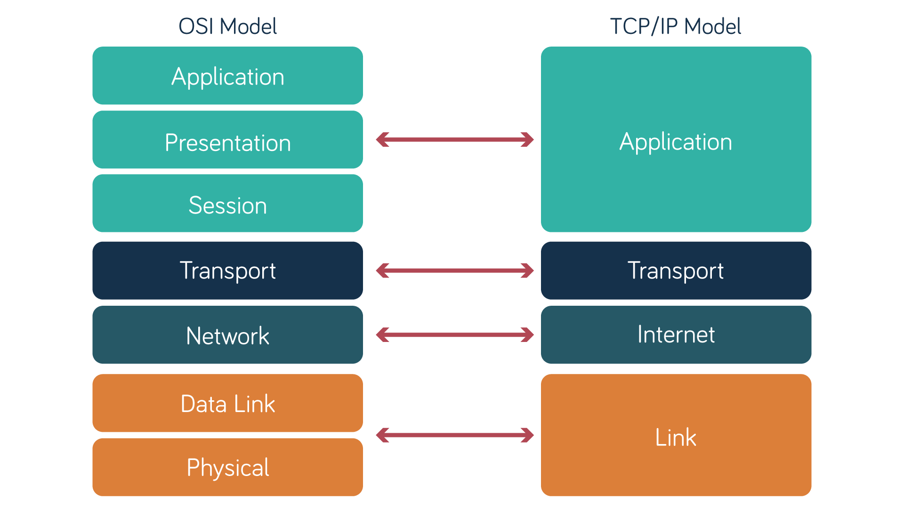
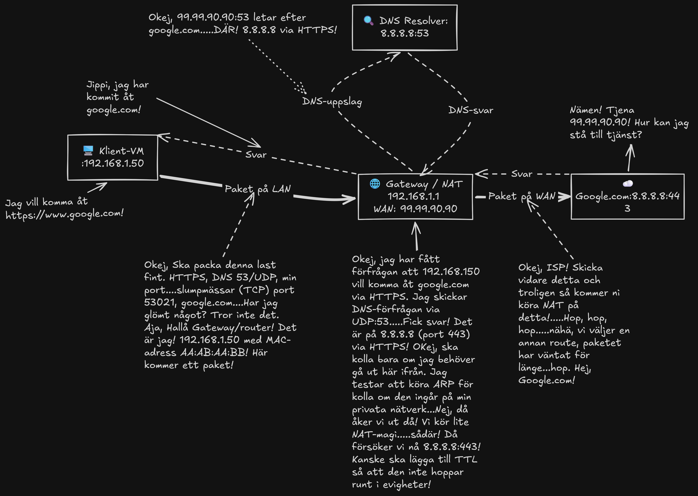

# Instruktioner & Bedömningsunderlag: Individuell Fördjupning
# 1. Introduktion

> [!IMPORTANT]
> **Kurs**: Introduktion till yrkesrollen och grunderna i IT-infrastruktur (MYH 2025/4008)
> 
> **Examinationsform**: Individuell teknisk fördjupningsuppgift (Summativ examination)
> 
> **Koppling till VG-krav i kursplanen**: Kursmål 2, 3 och 8

> [!NOTE]
> **Student**: Joakim Tran
> 
> **Beskrivning**: _"Uppgiften bygger vidare på den praktiska labbmiljön samt teorin om nätverk, operativsystem och säkerhet. Den studerande ska självständigt analysera, konfigurerar 
> och dokumentera en avancerad labbsituation samt resonera kring underliggande mekanismer."_

# 2. Moment A: Avancerad Nätverksanalys & Trafikflöden (Mål 3)

**Beskrivning**: Mitt mål är att rita upp och förklara ett datapakets resa hela vägen från min dator i labbet ut på internet. Jag går igenom hur domännamnet först översätts via DNS, 
hur trafiken slussas ut genom det lokala nätet och gatewayen, samt vad som faktiskt sker i TCP/IP-modellens olika lager när MAC-adresser byts ut och IP- samt portadresser styr paketet till rätt destination.

## Nätverkets resa

Vi kan börja med att välja en adress eller domän. Varför inte den klassiska google.com (8.8.8.8)? Men först! Ska vi gå genom OSI | /TCP/IP? Vad är skillnanden mellan OSI och TCP/IP?
Det korta och snabba svaret är att TCP/IP "använder" 5 lager/skikt medans OSI "använder" 7 lager/skikt. Se bilden nedan för förtydligande. I detta fallet så räcker det gott och väl med TCP/IP

### TCP/IP

| Skikt (TCP/IP) | Data / Protokoll | Vad händer lokalt | Vad händer i routern/gatewayen (NAT)? |
| :--- | :--- | :--- | :--- |
| **Applikation (L7/L5)** | HTTP / TLS / DNS | Här skapas lasten eller förfrågan till google.com | Hittills opåverkad om den är krypterad, om inte så skickas det i öppen/klartext HTTP protokoll. Detta är farligt då allt är synligt och kan modifieras eller bli spårad |
| **Transport (L4)** | TCP / UDP | Här kan det sättas **Source Port** (t.ex.`50000` port range då det finns många fler att slumpmässa fram) och **Destination Port** som 99,9% är `443` för HTTPS, `53` för DNS (Vi pratar inte om dem andra just så som `80`för HTTP eller `853`för TLS just nu. Lite överkurs för denna presentationen). | **Port Address Translation (PAT):** Routern kanske behöver mappa om Source porten för att matcha vad NAT vill ha. Så att dem inte går till portar som är stängda eller helt enkelt underlätta kommunikationen mellan klienter och webbsida. |
| **Nätverk (L3)** | IP | Vi sätter t.ex. **Source IP** `192.168.1.50` och **Dest IP** (8.8.8.8) google.com. | **Source NAT eller bara NAT:** Här händer magin! Här tolkas och dirigeras nätverket till sina rätta platser. I detta fallet så vill `192.168.1.50` komma åt google.com (8.8.8.8) och routern gör sin magi och sen slussar den ut förfrågan till från routern, eller ja, från klientens perspektiv Gateway och nu måste förfrågan passera ut till den publika IP. Vi kan även snabbt ta upp TTL (Time to live). Alltså hur länge ett last/paket/förfrågan får "leva" på varje hopp fram till google.com. Annars så kan man råka ut att det åker runt i cirklar! Du trodde heller väl inte att det var en rakt sträcka till google.com!? |
| **Länk / Datalänk (L2)** | Ethernet | **Source MAC** (klientens nätverkskort) och **Destination MAC** (Default Gateways MAC-adress). | Ah! Dem fysiska länkarna och adresserna! Dem måste ju hitta varandra fysiskt också. MAC-adresser är som namnet på enheterna.**OBS!** Numera så kan man slumpmässa fram MAC-adresser för säkerhetens skull innan den skickas ut från publika IP eller att varje hopp/NAT men vi håller oss till privat nätverk så länge. Här tas reda på vilka och vad för enheter som pratas. I detta fallet är det ju klientens nätverkskort som säger till att jag har denna MAC-adress så du vet det! Gateway/routern säger "OKEJ! Då vet jag! Jag har denna MAC-adressen så du vet de med!" Coolt säger båda och nu är vi ihopkopplade via Ethernet och kan prata med varandra!

# 3. Moment B: Jämförande OS- och Behörighetsanalys (Mål 2)

##

##

# 4. Moment C: Spårbarhet & Överlämningsdokumentation (Mål 8)

## Specifikation Moment B

> [!NOTE]
> ### Uppgiftsspecifikation: Moment B
> 
> #### 1. Företagsscenario & Konto-uppsättning
> Skapa följande kontostruktur i både Linux och Windows:
> * **Grupper:**
>   * `g_ledare` (För chefer/ledare)
>   * `g_personal` (För övrig personal)
> * **Användare:**
>   * `alice` (Medlem i `g_ledare`)
>   * `bob` (Medlem i `g_personal`)
> 
> #### 2. Mappstruktur & Kravmatris
> Skapa en huvudmapp som heter `Projekt` med två undermappar:
> 1. `Projekt/Gemensamt`
> 2. `Projekt/Ledning`
> 
> Sätt följande behörigheter på mapparna:
> 
> | Mapp | Grupp: `g_personal` (Bob) | Grupp: `g_ledare` (Alice) | Specialkrav / Testfall |
> | :--- | :--- | :--- | :--- |
> | **`Projekt/Gemensamt`** | Läsa & Skriva | Läsa & Skriva | Skapa en testfil här som båda ska kunna redigera. |
> | **`Projekt/Ledning`** | Ingen åtkomst | Läsa & Skriva | `g_personal` ska nekas tillträde helt. |